This is a repository collecting information on the Filioque. Its goal is to paint an accurate picture of the development with a focus on a reevaluation of the conflict in objective terms unshaped by the apologetics of each side.

Here is the legend for the graph below.

```mermaid
graph TB
    subgraph Shapes
        council[("Council    ..")]
        imperial{{"Imperial Edict    ..."}}
        baptismal(["Baptismal Creed    ..."])
        consensus[/"Consensus Creed    ..."\]
        eucharistic[["Eucharistic Creed    ..."]]
        miscellaneous("Miscellaneous    ...")
        style council fill:#00000000
        style imperial fill:#00000000
        style baptismal fill:#00000000
        style consensus fill:#00000000
        style eucharistic fill:#00000000
        style miscellaneous fill:#00000000
    end

    subgraph Colors
        basic["'the Holy Spirit'  ..."]
        extra["additional HS statements  ....."]
        proceeds["'who proceeds from the Father...'  ......."]
        receives["'... and receives from the Son'  ......"]
        through["'... through the Son'  ...."]
        filioque["'... and the Son'  ..."]
        style basic fill:#000000
        style extra fill:#084B83
        style proceeds fill:#3E4E77
        style receives fill:#75506C
        style through fill:#AB5360
        style filioque fill:#E15554
    end
```

And here is a graph detailing the relationships between statements about the Holy Spirit in creeds.

```mermaid
graph TB
    edict{{"==== Edict of Thessalonica (380) ===="}}
    edict ~~~ constantinople
    epiphaniusb ~~~ edict

    subgraph Greek
        deirbalyzeh(["Deir Balyzeh (~350)"])
        deirbalyzeh ~~~ jerusalem

        jerusalem(["Jerusalem (~350)"])
        style jerusalem fill:#084B83
        
        nicea[("Nicea (325)")]
        constantinople[("Constantinople? (381)")]
        ephesus[("Ephesus (431)")]
        chalcedon[("Chalcedon (451)")]
        style nicea stroke-dasharray:3
        style constantinople stroke-dasharray:3
        style constantinople fill:#504E73
        style chalcedon fill:#504E73
        style antiochian fill:#504E73
        style byzantine fill:#504E73

        nestorius["Nestorius (430)"]
        eusebius["Eusebius"]
        basil["Basil"]
        epiphaniusa["Epiphanius A (374)"]
        epiphaniusb(["Epiphanius B (374)"])
        athanasius["Athanasius"]

        style epiphaniusa fill:#504E73
        style epiphaniusb fill:#995264

        antiochian[["Antioch (~475)"]]
        byzantine[["Byzantine Rite (6th c.)"]]

        nicea --> basil
        nicea --> eusebius
        nicea --> nestorius
        nicea --> athanasius
        nicea --> epiphaniusa

        jerusalem --> epiphaniusa

        epiphaniusa --> epiphaniusb
        epiphaniusa --> constantinople

        constantinople --> chalcedon
        constantinople --> antiochian
        constantinople --> byzantine

        ephesus ~~~ nestorius ~~~ ephesus

        ephesus ~~~ chalcedon
        chalcedon ~~~ antiochian
        constantinople ~~~ ephesus
        constantinople ~~~ nestorius
    end

    subgraph Armenian
        armenian(["Armenian (~425)"])
        armenia[["Armenia (unk.)"]]
        style armenian fill:#504E73
        style armenia fill:#504E73
        armenian --> armenia
    end

    subgraph Latin
        oldroman(["Old Roman (~150)"])
        damasus(["Damasus (382-447)"])
        leo("Leo Epistle 15 (447)")
        apostles(["Apostles' (~450)"])
        toledoa[/"Toledo I (400)"\]
        toledob[/"Toledo II (447)"\]
        toledoc[/"Toledo III (589)"\]
        athanasian[/"Athanasian (5th c.)"\]

        spain[["Spain (6th c.)"]]
        gallican[["Gallican Rite? (7th c.)"]]
        frankia[["Frankia (8th-9th c.)"]]
        hre[["Holy Roman Empire (10th c.)"]]
        rome[["Rome (11th c.)"]]

        style oldroman fill:#000
        style apostles fill:#000
        style damasus fill:#E15554
        style leo fill:#E15554
        style toledoa fill:#3E4E77
        style toledob fill:#E15554
        style toledoc fill:#E15554
        style athanasian fill:#E15554
        style spain fill:#E15554
        style gallican fill:#E15554
        style athanasian fill:#E15554
        style frankia fill:#E15554
        style hre fill:#E15554
        style rome fill:#E15554
        
        oldroman --> apostles
        athanasian ~~~ toledoc

        toledoa --> toledob
        toledob -. "and the son" .-> toledoc
        toledoc --> spain

        damasus --> leo
        leo -. "homoousias ... and the son" .-> toledob
        oldroman ~~~ nicea

        spain --> gallican
        gallican --> frankia
        frankia --> hre
        hre --> rome
    end

    constantinople --> armenian
    damasus ~~~ constantinople ~~~ damasus
    chalcedon --> toledoc

    antiochian ~~~ byzantine
    antiochian ~~~ spain

    toledoc ~~~ armenia
    armenian ~~~ nestorius
```

